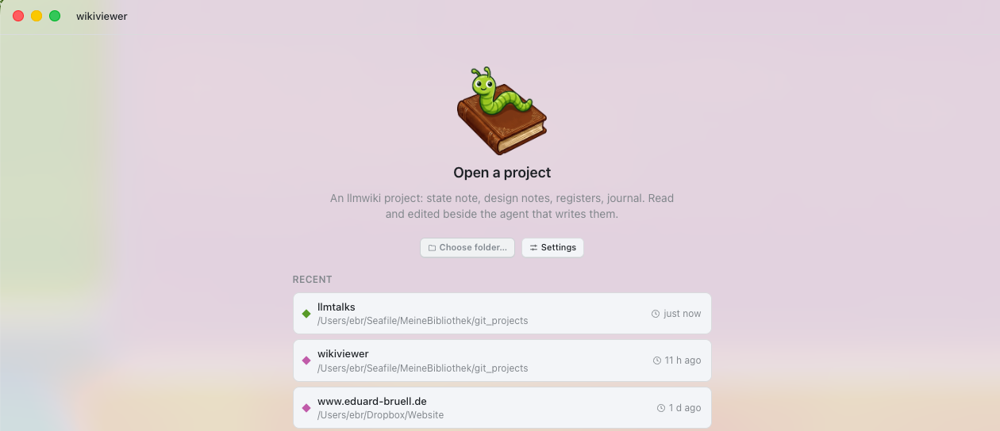

# Inchworm <a href="https://github.com/edubruell/Inchworm"></a>

[](https://opensource.org/licenses/MIT)

A small desktop app for reading and editing **llmwiki** project memory: the
wiki your coding agent writes, and the skill that teaches it how.



If you run an agent (Claude Code or similar) against a repo over many
sessions, it needs somewhere to put what it learns, decides and still owes
you, or it re-derives all of it every session. The `/llmwiki` skill bundled
here is a fixed schema for that: a curated state file, numbered design notes,
several append-only registers and a dated journal, each with a defined job
the agent follows rather than inventing its own structure, plus SessionStart
hooks that check the structure is actually being kept up. Inchworm is a
viewer and editor for it, meant to sit next to a built-in terminal running the
agent, so you can watch what it just wrote without switching into a
general-purpose editor and losing the plot of which files matter. Colour
coded windows and terminals let you tell multiple agents and their wikis
apart at a glance.

## What it does

- **Reads a project's wiki** in schema order: state note, numbered design
  notes, registers, journal, with cap gauges, backlinks and an outline.
- **Edits source, byte-faithfully.** A CodeMirror editor in source mode; a
  save never reformats markdown, reorders a register, or changes the file's
  line endings. A sha guard catches a conflicting write from outside the app
  (the agent, git, another window) before it can be overwritten.
- **Appends to registers** from their own template, never out of order:
  registers in this schema are meant to grow at the bottom or not at all.
- **Runs a terminal alongside the wiki**, one per project, so the agent that
  writes these files can run in the same window that reads them.
- **Opens more than one project**, each window scoped to its own project, its
  own accent colour, its own terminal.
- **Installs the `/llmwiki` skill** itself, from Settings, so a new project
  can start using this schema without a manual copy.

## Requirements

Built and tested on **macOS, Apple silicon (arm64)**. 

## Running it from source

```
npm install
npm run dev      # Electron app, hot-reloading
npm run dist      # packaged .app / .dmg under release/
```

`npm test` runs the suite, `npm run check` runs lint, typecheck and tests
together. `src/core`, the part of the app that understands the llmwiki
schema, carries the coverage floor; nothing that touches Electron, the
filesystem or a terminal lives there.

## The `/llmwiki` skill

The schema Inchworm reads is defined once, in `skills/llmwiki/`, and vendored
into this repo so a clone can install it without a separate download:

```
./skills/llmwiki/install.sh
```

See `skills/llmwiki/README.md` for what it installs
and how to keep a project's wiki in sync with it. A few things about it that
aren't obvious from "structured markdown files":

- **The schema is opinionated.** `00_state.md` is capped at
  60 lines and holds only what's actively changing; a decided design element
  lives in exactly one numbered note; registers (`decisions.md`,
  `findings.md`, `gotchas.md`, `contentions.md`, `tried.md`, `ideas.md`) are
  append-only and each has one job. A cap that's about to be breached is met
  by moving lines out whole, never by shortening a fact to fit.
- **A hook checks the memory stays honest.** A register entry
  that names a note is half a write; `wiki-sweepcheck.py` runs at session
  start and reports the other half as debt if the note was never actually
  edited, instead of letting the drift go unnoticed.
- **Open questions have a lifecycle, and don't get silently resolved.**
  `contentions.md` tracks fragile assumptions with a stated "resolves when"
  condition; a ripeness checker brings a stale or resolvable one back to the
  user rather than leaving an agent to decide on its own that the question is
  settled.
- **Standing obligations can be armed to nag.** A `trigger` line ties a
  landed artefact (a file, a glob, a marker) to a write-up that's still owed;
  the obligation surfaces at session start until it's discharged.
- **The wiki is local, not shared team documentation.** It's gitignored by
  design, kept out of the repo's own history; stable material that's meant
  for people, not just the agent, is promoted to tracked `docs/` instead.

That's a different bet than most memory-bank patterns for coding agents,
which tend to give the agent a folder of markdown and let it decide the
structure and what's worth writing down as it goes, or hand memory off to an
external vector or graph store the agent queries at will. `llmwiki` keeps
memory as plain files in the project, but fixes the schema and enforces the
bookkeeping around it mechanically, giving you a readable, structured project
memory. The theory behind this is that a memory layer with no enforced
structure degrades the same way an unlinted codebase does, unnoticed and
mostly in the parts nobody's looking at.

## License

MIT, see `LICENCE`.
